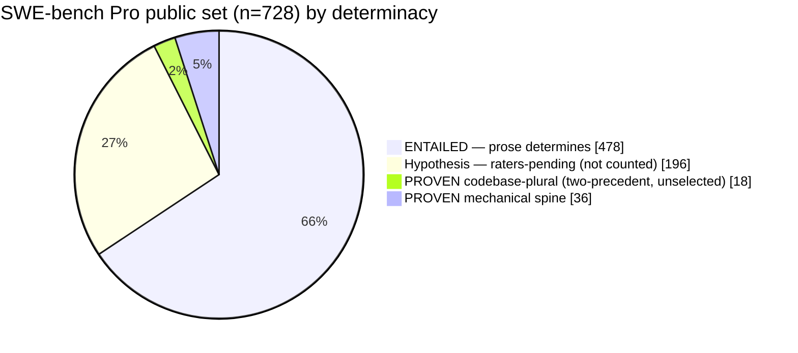

# swebench-pro-audit

A construct-validity audit of **SWE-bench Pro**, a contamination-resistant successor tier to SWE-bench
Verified. The question is not "is Pro contaminated" (it is resistant by design, and that holds up). The
question is **how much of the public set is determinate enough that passing the hidden test means solving
the problem as stated** — and, relatedly, where a harness's score comes from.

**All 728 public tasks are labeled.** Every verdict is mechanical and re-derivable from committed
receipts — the graded behavior is in [`hidden_test.diff`], its anchor verifies in [`gold.diff`], and you
can check whether any clause covers it in [`spec.md`]. Rebuild the tables from gold + test + prose —
two ways, in [`docs/REPRODUCE.md`](docs/REPRODUCE.md): **verify it yourself** (no deps) or **reproduce the
data yourself** (the full recipe).

## Motivation

A benchmark number is only as meaningful as the determinacy of its tasks. If the problem statement does
not pin the behavior the hidden test checks, then passing that test is not evidence of *solving the
problem as stated* — it is evidence of recovering the author's unstated choice, by reading the test
(oracle), recalling the merged PR (contamination), or guessing. Pro is contamination-resistant, which
removes recall — so on Pro the open question is **prose-underdetermination**: how often is the graded
behavior simply not in the materials the solver receives?

This audit answers that for the whole public set, and separates what's *provable today* from what needs a
rater panel. It exists because we built a Pro harness whose oracle-free arms produced a null we couldn't
explain from outside — see COI below.

## Terms

| term | meaning |
|---|---|
| **oracle** | the held-out test. "Oracle-free" = the solver never sees it; it only grades afterward. |
| **prose** | what the solver receives: problem statement + requirements + interface (no test). |
| **gold** | the accepted reference patch for a task. |
| **GAP** | a behavior the gold implements and the hidden test checks, but **no prose requirement states**. |
| **ENTAILED** | every graded behavior has a covering requirement (no GAP) — prose determines the fix. |
| **AMBIGUOUS (screen)** | ≥1 GAP — a *candidate*, not yet a claim. |
| **witness** | the per-tier evidence that upgrades a candidate to a claim (see the grid below). |
| **mechanical spine** | the claims that need no rater: airtight + graded-patch + hand. |
| **R2** | an alternative implementation that follows the prose but takes the *other* reading; used in the graded-patch proof. |
| **two-precedent rule** | when the codebase has ≥2 comparable live conventions and the prose is silent, the test is choosing among unstated alternatives → ambiguous. |
| **hypothesis** | screen-flagged but lacking a qualifying witness — raters-pending, **not counted**. |
| **KNOWN_BAD** | the gold patch fails its own grader (a mechanical defect). |

## Classification — how every task is labeled

We mark a task **AMBIGUOUS** only when the hidden test checks a behavior the prompt does not require, and
the claim carries an auditable witness: an absent arbitrary constant, a rejected prose-faithful patch, an
explicit prose contradiction, or multiple live codebase conventions. The coverage screen
([`tools/judge_pool.py`](tools/judge_pool.py)) labels every tested behavior against prose+gold; a **GAP**
is a behavior the gold implements and the test checks but no requirement states. Verdict: **ENTAILED** (no
GAP) or **AMBIGUOUS-screen** (≥1 GAP). The screen only flags; a candidate is *claimed* only with a witness
whose burden its tier defines:

| tier | claim | witness (the burden) | claimable without raters? |
|---|---|---|---|
| **airtight** | the choice is an arbitrary constant present **nowhere a solver reads** | constant absent from prose **and** the codebase at base_commit (grep) | **yes** — mechanical |
| **graded-patch** | a prose-faithful alternative impl exists and the bench rejects it | R2 both opus & codex (blind, no gold/test) call prose-faithful, then the official grader fails R2 on the discriminating test while PASS_TO_PASS stays green | **yes** — mechanical |
| **prose-affirmative (hand)** | the prose explicitly describes the alternative the test rejects | the verbatim clause (tutao) | **yes** — mechanical |
| **codebase-plural** | the codebase does the choice **>1 live way**, prose silent, and **no ordinary convention selects** | ≥2 comparable, live, prose-silent precedents at base_commit (grep-verified; tests/examples/vendor/generated/deprecated excluded) **+ unselected**: the convergence rater also fails to resolve it (else the plurality is apparent, not binding — demoted) | **under the two-precedent+unselected rule** (a stance a reader can contest) |
| **hypothesis** | screen-flagged, no qualifying witness | — | **no** — raters-pending, **not counted** |
| **KNOWN_BAD** | gold fails its own grader | reference patch scores reward≠1 at the pinned commit | **yes** — mechanical, results-independent |

Integrity rules (full spec: [`docs/ADMISSIBILITY-SPEC.md`](docs/ADMISSIBILITY-SPEC.md)): labels are built
**blind to our harness's win/loss**; ambiguity is claimed only on **positive evidence** (an absent
constant, a shown contradiction/drift, a graded failure) — never on failure-to-find (that is UNKNOWN); and
a passing patch never proves DETERMINED, symmetric to a failing patch never proving AMBIGUOUS.

## Results (n = 728)

(KNOWN_BAD = 3 gold-fails-grader defects sit alongside, frozen and sweep-confirmed.)

| label | count | of N |
|---|---:|---:|
| ENTAILED | 478 | 66% |
| AMBIGUOUS — screen (≥1 GAP) | 250 | 34% |
| &nbsp;&nbsp;**PROVEN — mechanical spine** (airtight 30 + graded-patch 5 + hand 1) | **36** | **4.9%** |
| &nbsp;&nbsp;**PROVEN — codebase-plural** (two-precedent **+ unselected** rule) | **18** | **2.5%** |
| &nbsp;&nbsp;hypothesis (raters-pending, not counted) | 196 | 27% |
| KNOWN_BAD (gold fails grader; full 731 sweep, 0 new beyond the frozen 3) | 3 | — |

**Two honest bars.** The headline **7.4%** is **4.9% mechanical + 2.5% codebase-plural**: the first term
needs no methodological buy-in (a hostile reader reproduces each from the receipts); the second depends on
accepting the **two-precedent rule**, now sharpened to require *unselected* plurality — ≥2 comparable live
conventions, prose silent, **and** not collapsed by an ordinary convention (cross-checked against the
convergence rater; this demoted 35 of an initial 53 to hypothesis). The 196 hypotheses are in **neither**
number. A separate **design-level divergence** axis (see [`docs/DETERMINACY-AXIS.md`](docs/DETERMINACY-AXIS.md))
raises the *candidate* union to **~20%**, but its mass is single-rater (panel-pending), so 20% is a
candidate ceiling, not yet receipt-defensible. A preregistered instrument with a proven spine, not a
population rate. Full table: [`COVERAGE.md`](COVERAGE.md).

## Recommendations

### If you run, report, or cite a Pro score
- **A raw % can over-credit reasoning when reported as problem-solving.** At least 4.9% of the public set
  is provably underdetermined (7.4% under the two-precedent+unselected rule; ~20% candidate union with the
  single-rater design-divergence axis) and 3 tasks have broken gold; passing
  those is oracle/guess, not solving. Report a **determinacy-weighted** denominator, or at minimum
  disclose that the headline mixes prose-determined and prose-underdetermined tasks.
- **The closest reasoning-only signal is the ENTAILED subset, scored oracle-free.** (Even there, residual
  implementation difficulty, localization artifacts, and flaky tests remain — it's the *closest* clean
  signal, not a pure one.) If you want a number that means "the model solved the stated problem," report
  that separately from a held-out-test score an agent can iterate against.
- **Don't compare harnesses by raw Pro %** when one uses an oracle-gated loop and another doesn't — you're
  comparing oracle access, not capability.

### If you optimize against Pro (harness builders)
- **In our oracle-free arms, reasoning did not recover the middle band** — diagnosis, cross-family
  diagnosis, and self-audit were inert or false-confident (see Interpretation). Treat the lift as
  iterate-to-green; don't mistake it for understanding.
- **A plausible oracle-free heuristic is convention-matching**, not deeper diagnosis: for a discrete choice
  the prose leaves open, match the nearest *comparable live* codebase convention rather than guessing (the
  companion's [`craft-convention`](https://github.com/kimjune01/swebench-pro) skill). It raises *lottery
  odds*, not reasoning — ceiling is the dominant-convention base rate — but it aligns with real-world craft
  (local consistency), so it's a reasonable default, not an overfit. (Measured lift: in progress.)
- **Don't game the denominator.** Editing test files, weakening assertions, or excluding your own losses
  inflates nothing real. Forbid test-file edits; capture source-only patches; grade on the official harness.

### If you build or maintain a bench
Every failure mode above inverts into a construction rule:
- **Admit by convergence, not by gold-passes-grader.** Before a task ships, check that competent
  from-prose solvers (a decontaminated panel) converge on the test-passing behavior; if they scatter, the
  task is divergent — tighten the prose until it converges, or cut it. The gold patch is *an* answer, not
  *the* answer.
- **Score each instance as a float in [0, 1], not pass/fail.** A binary `resolved` throws the whole
  instance away over a single missed pluralistic convention — a model that nails 11 of 12 graded behaviors
  scores identically to one that fixed nothing. A partial-credit score decouples the determinate majority
  from the divergent minority:

  > **score(instance) = clamp₀₁( (new tests passed − tests regressed) / new tests introduced )**

  i.e. of the `FAIL_TO_PASS` tests a task adds, the fraction the patch passes, penalized by any
  `PASS_TO_PASS` regression, clamped to [0, 1]. It's computable today from the grader's per-test output
  (`_output.json`). This is **imperfect** — it weights all assertions equally, and a divergent assertion
  still costs its `1/N` share (mitigation, not cure) — but it is *strictly less imperfect* than binary,
  which sends the whole instance down the drain for one underdetermined check. On `qutebrowser-e34dfc68`,
  binary reads `0` (233/248 passing, lost on a 15-case DNS matrix the prose never pins); the float reads
  the determinate work actually done. Report the determinacy-weighted mean of these floors.
- **Separate the divergent set.** Publish which instances are design-divergent (see
  [`docs/DETERMINACY-AXIS.md`](docs/DETERMINACY-AXIS.md)) so consumers can score on the determinate subset
  when they want a reasoning signal.

## Interpretation — where the harness lift comes from

These are **mechanism checks, not population estimates**: small oracle-free ablations that show the tested
interventions did not explain the lift. They motivate the audit; the audit (above) is the population claim.

A Pro score plausibly decomposes into three bands (the floor is a contaminated estimate; the structure is
interpretive, not an audited label):

| band | what it is | reachable by |
|---|---|---|
| floor (~50%, contaminated est.) | the prose **determines** the fix; a capable model implements it directly | reasoning alone |
| +45 (floor → ~95%) | the prose **under**determines the fix; the held-out test determines it | the oracle (iterate-to-green), recall, or a lucky guess |
| ~5% (~95% → 100%) | irreducibly hard implementation + bench defects | nothing, within budget |

The middle band is where our oracle-free arms drowned, and the audit shows a concrete lower bound of
underdetermination underneath it. What the ablations found (agent never sees the held-out tests; graded after):

- **Diagnosis is inert.** Test-free prose diagnosis → implementer changes nothing: recon→craft ≡
  craft-only, **0/6 discordant** (codex/gpt-5.5, same model both arms — contamination-clean delta).
- **Cross-family diagnosis is also inert.** Opus-4.8 diagnosis → codex craft rescued **0/4**; blind-craft
  run-to-run variance exceeds the diagnosis effect.
- **Self-authored verification is false-confident.** Oracle-free self-repro + iterate: **4/4 self-declared
  "AUDIT GREEN", 0/4 actually resolved.**
- **Losses are downstream of *solved* localization.** On `qutebrowser-e34dfc68`, diagnosis recall vs gold
  is **1.0 (8/8 regions)** and it still loses — craft rebuilt the gold's concept, passed 233/248, lost on
  a 15-case DNS matrix the prose never specifies. Recall tracks fix-*breadth*, not inquiry quality.

## What this is NOT

- **Not a contamination claim about Pro.** Pro is contamination-*resistant*; a gold-overlap audit puts the
  frontier pair at ~2%. The recall story is **Verified's** and does not transfer. This audit needs no
  contamination claim.
- **Not "benchmarks have flawed tests."** That's established for Verified (OpenAI; Aleithan 2024;
  Wang/Pradel/Liu 2025). The contribution is the determinacy classification over the whole public set, plus
  the causal mechanism checks. See [`docs/PRIOR-ART.md`](docs/PRIOR-ART.md).
- **Not a rescue of any harness.** Oracle-free *everything* failed in our arms.

## Honest limits

- **n = 728 is done** (the whole public set), so sampling bias no longer binds the spine. What remains
  gated is the **hypothesis tier (196)**: codebase-vs-borderline is interpretive and needs ≥2 independent
  raters + κ before any of it counts — reported separately, excluded from both headline bars.
- **The codebase-plural tier rests on the two-precedent rule** — guarded against cherry-picking but a
  stance a reader can contest. The 4.9% mechanical spine needs no such buy-in.
- **The ablations are mechanism checks, small n**; they show the tested oracle-free interventions did not
  recover the lift, not that none could. The ~50% floor is a contaminated estimate; the clean
  prose-determined floor (oracle-free + post-cutoff) is unmeasured.

## Position / conflict of interest

We authored a Pro harness and paper ([swebench-pro](https://github.com/kimjune01/swebench-pro),
[the methodeutic harness](https://june.kim/the-methodeutic-harness-on-swebench-pro)) whose oracle-free arms
produced the null this audit investigates. That is a conflict of interest, and also the source of the
question — a disinterested party never reads a task's requirements against its hidden test line by line. We
disclose it as provenance, not penance, and ask for no trust on the verdicts: to reduce discretion, labels
are built **blind to our harness's win/loss**, cover the **whole** public set, and are backed by committed
receipts (`spec.md`, `gold.diff`, `hidden_test.diff`, and per-case witness files). A reader who suspects
motivated reasoning can ignore the prose and reproduce the tables from gold + test + prompt. Methodology
reuses our [DeepSWE audit](https://june.kim/auditing-deepswe) (gold-passes-verifier, denominator hygiene,
the cold second read, the specification-lottery pattern).

## Layout

- [`SUMMARY.md`](SUMMARY.md) — the two-bar headline + coverage table. [`COVERAGE.md`](COVERAGE.md) — all 728 rows.
- [`KNOWN_BAD.md`](KNOWN_BAD.md) · [`KNOWN_AMBIGUOUS.md`](KNOWN_AMBIGUOUS.md) (PROVEN tier + hypothesis count) · [`OUR_CAPABILITY_GAPS.md`](OUR_CAPABILITY_GAPS.md) (we lost, prose determines). Regenerated by [`tools/build_ledgers.py`](tools/build_ledgers.py).
- [`docs/REPRODUCE.md`](docs/REPRODUCE.md) — verify-it-yourself (no deps) + reproduce-the-data-yourself (recipe), with the pinned dataset revision.
- [`docs/DETERMINACY-AXIS.md`](docs/DETERMINACY-AXIS.md) — design-level divergence (the second axis): ~16% opus single-rater, ~69% prose-literal-silence diagnostic, the rater-asymmetry, and the no-double-count union with the per-behavior spine.
- [`docs/ADMISSIBILITY-SPEC.md`](docs/ADMISSIBILITY-SPEC.md) — label grid, witness burdens, blind-construction + positive-evidence rules. [`docs/PRIOR-ART.md`](docs/PRIOR-ART.md), [`docs/FINDINGS.md`](docs/FINDINGS.md), [`docs/AUDIT-CHECKLIST.md`](docs/AUDIT-CHECKLIST.md).
- `data/pro_repl_fields.json` — vendored canonical 728-task solver-prose (so regeneration is self-contained).
- `data/cases/<id>/` — receipts: `spec.md`, `gold.diff`, `hidden_test.diff`, `fail_to_pass.txt`, and where present `AMBIGUITY_WITNESS.md` / `r2.diff` / `r2_grade.json` / `codebase_ambiguity.json`. `data/attribution/<id>.md` — coverage table. `data/judge/<id>.json` — raw rows. `data/gold_sweep/` — the full-731 gold-sweep result.
- Tools: `materialize.py`, `judge_pool.py`, `witness.py`, `r2_promote.py` + `grade_r2.py` + `grade_r2_fleet.py`, `codebase_ambiguity.py`, `diag_oracle.py`, `build_ledgers.py`.

Harness, drivers, fleet, and the `craft-convention` skill live in the companion repo
[`swebench-pro`](https://github.com/kimjune01/swebench-pro).

## License

Dual-licensed (copyleft): code (`tools/`) under [AGPL-3.0](LICENSE-CODE.txt); everything else (prose,
findings, `data/` receipts) under **CC BY-SA-NS** (CC BY-SA 4.0 + a Network Services clause). See
[`LICENSE.md`](LICENSE.md) and [june.kim/cc-by-sa-ns](https://june.kim/cc-by-sa-ns). Build a service on
this and source flows back to users; no paywall, no gated access.
