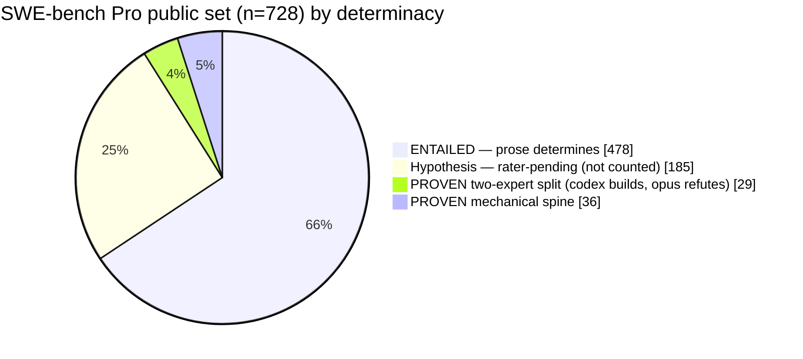

# A Determinacy Audit of SWE-bench Pro: How Much of the Public Set Pins the Behavior It Grades

**June Kim** · [`kimjune01`](https://github.com/kimjune01) · 2026-06-09

A construct-validity audit of **SWE-bench Pro**, the contamination-resistant benchmark OpenAI now recommends in place of Verified. The question is not whether Pro is contaminated (it is resistant by design, and that holds up). The question is **how much of the public set is determinate enough that passing the hidden test means solving the problem as stated.**

## Abstract

A benchmark score is only as meaningful as the determinacy of its tasks: if the problem statement a solver receives does not pin the behavior the hidden test grades, then passing that test is not evidence of solving the stated problem, but of recovering an unstated choice by some other means. SWE-bench Pro is contamination-resistant by construction, which removes recall as that other means and leaves the open question squarely on construct validity. We audit all **728 public SWE-bench Pro tasks** for determinacy: a task's graded behavior is *determinate* when the materials a solver actually receives (problem statement, requirements, interface, and the repository source at the base commit) select it, and *underdetermined* otherwise. We report a deliberately two-tier result. A mechanically provable tier of **36 tasks (4.9%)** carries receipts a hostile reader reproduces without trusting us: an arbitrary graded constant absent from prose and codebase alike, a prose-faithful alternative implementation the official grader rejects, or a verbatim prose clause the test contradicts. A second tier of **29 tasks (4.0%, cumulative 8.9%)** meets a *two-expert standard*: two competent engineers, given only the prose and the source, would both produce a requirement-faithful implementation that the hidden test splits. These splits are adversarially verified by two model families (one constructs the existence proof, an independent one tries to refute it; 29 of 41 candidates survived, and a symmetric pass over the determined cases recovered no missed splits; Cohen's κ = 0.52). We additionally confirm three gold-fails-grader defects and at least one feature mismatch, where the prose describes one feature and the gold and test grade another. Every verdict is re-derivable from committed per-case receipts. We do not claim a population rate beyond the proven floor; 185 further screen-flagged candidates remain rater-pending and are excluded from both bars. The practical implication: a raw Pro percentage conflates solving the stated problem with recovering the author's unstated choice, and should be reported against a determinacy-aware denominator.

## How to read this

This is a GitHub-native artifact, not a linear PDF. This README is the paper, self-contained for a first read; the data-heavy sections link to the canonical, regenerable documents rather than duplicating them, so numbers cannot drift between the paper and its receipts. The reading graph:

- **The standard and how every task is labeled** → §4, full specification in [`docs/ADMISSIBILITY-SPEC.md`](docs/ADMISSIBILITY-SPEC.md).
- **The headline numbers** → §6, regenerated table in [`SUMMARY.md`](SUMMARY.md).
- **Every claim, one row** (inspect, don't trust) → [`CLAIMS.md`](CLAIMS.md); all 728 task verdicts → [`COVERAGE.md`](COVERAGE.md).
- **Related work** → §2, annotated and confidence-flagged in [`docs/PRIOR-ART.md`](docs/PRIOR-ART.md).
- **Exploratory mechanism checks** → §8, underlying runs in [`docs/FINDINGS.md`](docs/FINDINGS.md).
- **The quarantined design-divergence axis (~20% candidate)** → [`docs/DETERMINACY-AXIS.md`](docs/DETERMINACY-AXIS.md), deliberately out of the headline.
- **Reproduce** → [`docs/REPRODUCE.md`](docs/REPRODUCE.md); **cite** → [`CITATION.cff`](CITATION.cff); **repository layout** → end of this page.

A skeptic can start at any row of `CLAIMS.md`, open that case's `spec.md` / `gold.diff` / `hidden_test.diff`, and check the verdict without reading the prose here at all.

## 1. Introduction

Benchmarks for autonomous software engineering grade a candidate patch by running a held-out test suite. The implicit assumption is that the test encodes the task: if the patch passes, the problem was solved. That holds only when the task's materials determine the behavior the test checks. When they do not, a passing patch has three other explanations: the solver read the held-out test (oracle access), recalled the merged pull request (contamination), or guessed and matched. The first two are mechanisms a harness or a frontier model can exploit without understanding the problem.

SWE-bench Verified suffers from the first two. OpenAI's February 2026 audit found a majority of audited Verified tasks have flawed tests that reject functionally correct submissions, and that frontier models reproduce exact gold patches; OpenAI stopped reporting Verified and recommended SWE-bench Pro. Pro is built to resist contamination, and on our own gold-overlap check that resistance holds. So on Pro the open question moves off recall and onto construct validity: independent of contamination, how often is the graded behavior simply not present in the materials the solver receives?

Consider `flipt-io_358e13bf`. Its problem statement asks for controlled deletion of references in a snapshot cache: "Fixed references cannot be deleted and remain accessible. Non-fixed references can be deleted." The gold patch and hidden test instead modify `internal/config/authentication.go` and assert a CSRF configuration default. The graded feature and the described feature are disjoint; no reading of the prose produces the behavior the test checks. An extreme case, but it makes the general point: passing the test and solving the stated problem can come apart, and the gap is measurable.

We measure it conservatively, separating what is provable from committed receipts with no methodological buy-in from what rests on a stated standard, and excluding everything that needs a rater panel we have not yet run. The contribution is the determinacy classification over the whole public set, the two-expert standard and its adversarial verification, and the resulting guidance for anyone who runs, reports, or builds on Pro.

## 2. Background and Related Work

Full annotations and confidence flags: [`docs/PRIOR-ART.md`](docs/PRIOR-ART.md).

- **SWE-bench** (Jimenez et al., ICLR 2024) builds tasks from public issues and PRs, the contamination surface later work exploits.
- **SWE-Bench+** (Aleithan et al., 2024) manually audited tasks: 32.67% solution leakage, 31% weak tests; filtering dropped a representative agent from 12.47% to 3.97%.
- **OpenAI, *Why SWE-bench Verified no longer measures frontier coding capabilities*** (Feb 2026): a majority of audited Verified tasks have flawed tests, plus exact-gold reproduction; recommends Pro.
- **Wang, Pradel, Liu** (ICSE 2026) use differential testing to show plausible patches pass tests yet diverge from developer intent. Adjacent to us: their axis is patches that pass but are wrong; ours is tasks whose materials do not determine which passing behavior is intended.
- **SWE-agent** (Yang et al., NeurIPS 2024): scaffold design materially moves scores, so a raw number conflates model and harness.
- **SWE-bench Pro** (Deng et al., Scale AI, 2025): the benchmark we audit; long-horizon, multi-file, contamination-resistant. Not an external audit of its own construct validity.
- **Our DeepSWE audit** (june.kim/auditing-deepswe, 2026): on a different benchmark, established the techniques reused here (gold-passes-own-verifier with isolation, denominator hygiene, retrievable per-case receipts, the per-task specification-lottery case).

OpenAI debunked Verified, not Pro, and recommends Pro; the contamination story is Verified's and does not transfer. The construct-validity question on Pro is thinly examined; this audit addresses it over the whole public set and needs no contamination claim.

## 3. The Benchmark and Audit Object

The audit covers the **public** set: tasks with retrievable problem statement, requirements, interface, gold patch, and tests. Pro's held-out private set is not auditable from outside, so every claim is scoped to the public set. We pin a dataset revision and freeze receipts at a release tag; Pro tasks can change after publication, a comparability caveat we record.

Solver materials per task are the problem statement, requirements, and interface (jointly, the *prose*) plus the repository source at the base commit. The grader runs a held-out suite; a task declares `FAIL_TO_PASS` (must pass after the fix) and `PASS_TO_PASS` (must stay passing). The accepted reference patch is the *gold*.

**Denominators.** The determinacy denominator is **N = 728**, the public prose-set. Three further tasks are gold-fails-grader defects (§6), carried from a pre-run audit, frozen before any scored run; they sit outside the 728 and are reported alongside. The gold sweep (§5) graded 731 bundles (the 728 plus those 3) and re-confirmed exactly the 3. Where 731 or 727 appears in the receipts it refers to sweep coverage, not the determinacy denominator.

## 4. The Determinacy Standard

We label a task by whether the materials determine the behavior the hidden test grades. Full specification, witness burdens, and integrity rules: [`docs/ADMISSIBILITY-SPEC.md`](docs/ADMISSIBILITY-SPEC.md).

**Terms.** *prose* = problem + requirements + interface (no test). *gold* = the reference patch. *GAP* = a behavior the gold implements and the test checks but no requirement states. *ENTAILED* = no GAP (prose determines the fix). *AMBIGUOUS-by-screen* = at least one GAP, a candidate not yet a claim. *witness* = the per-tier evidence that upgrades a candidate to a claim.

**The screen.** A coverage step labels every tested behavior against prose and gold, yielding ENTAILED or AMBIGUOUS-by-screen. The screen flags; it does not by itself establish a defect.

**From candidate to claim.** A flagged task becomes a claim only with a witness, and the witness burden defines the tier, in decreasing order of how little it asks the reader to accept:

| tier | the claim | the witness | needs a rater? |
|---|---|---|---|
| **airtight** | the graded value is an arbitrary constant present nowhere a solver reads | absent from prose **and** the codebase at base commit (grep), present only in gold and test | **no** |
| **graded-patch** | a prose-faithful alternative implementation exists and the grader rejects it | two models, blind and independent, judge an alternative patch prose-faithful; the official grader then fails it on the discriminating test while regressions stay green | **no** |
| **hand-verified** | the prose explicitly describes the reading the test rejects | the verbatim clause | **no** |
| **two-expert split** | two competent engineers given only prose and source both write a faithful implementation the test splits | an existence proof on a prose- or source-plurality axis, constructed by one model family and surviving refutation by another (§5) | a stated standard, two-model verified |
| **hypothesis** | screen-flagged, no qualifying witness | none yet | yes, rater-pending; **not counted** |

**The two-expert standard, precisely.** A benchmark instance is determinate only if the supplied materials select the behavior being graded. If two independent expert implementations are each faithful to the prose and to live source conventions, and the hidden test accepts one while rejecting the other, the test is not measuring whether the stated task was solved; it is measuring recovery of an unstated authorial choice. This holds even when the chosen branch is reasonable, conventional, or in hindsight preferable. The flaw is not that experts can disagree; it is that the benchmark assigns one branch a zero without having supplied the information that selects it. A split is proven on either of two axes: **prose plurality** (the requirement text licenses ≥2 faithful readings) or **source plurality** (the codebase already makes the same decision ≥2 live, comparable, prose-silent ways at the base commit).

**Integrity rules.** Labels are built blind to our own harness's win or loss. Ambiguity is claimed only on positive evidence (an absent constant, a graded rejection, a shown contradiction or plurality), never on failure to find a convention; where neither determined nor underdetermined can be established, the label is UNKNOWN and no claim is made. Symmetrically, a passing patch never proves a task determinate.

## 5. Methods

**Coverage screen.** Each task's tested behaviors are enumerated against the fixed test set and labeled covered or GAP relative to prose and gold.

**Mechanical-spine witnesses.** Airtight cases are settled by grep (the discriminating constant is absent from prose and base-commit source). Graded-patch cases construct an alternative implementation taking the other reading, pass it through a blind two-rater prose-conformance gate (two families each see only prose and patch, never gold, test, or each other), then grade it officially; the witness is the two faithful judgments plus a mechanical rejection with no regressions. The single hand-verified case cites the contradicting clause.

**Two-expert splits: construct, refute, advocate.** For each plurality candidate, one model family (GPT-5.5) constructs an existence proof on the prose or source axis (the two faithful readings, or the ≥2 live conventions, with verbatim spans or snippets). An independent family (Claude Opus) then attempts to refute each split: one reading is not in fact faithful, the prose or interface does select, or the cited precedents are lookalikes rather than the same decision. A split is retained only if it survives. To bound the opposite error, the same independent family runs an advocate pass over the cases the constructor called determined, attempting to find a missed split. We report inter-rater agreement and treat the surviving set as a floor.

**Gold-passes-grader sweep.** Every gold is graded by the official evaluator at the pinned commit under a two-pass isolation protocol (grade all in parallel, then re-run every non-passing task alone, so a transient failure is never logged as a defect). All patches are source-only (test-file edits stripped); no bespoke grader is used.

## 6. Results

Over the public set (N = 728). Regenerated table: [`SUMMARY.md`](SUMMARY.md).

| label | count | of N |
|---|---:|---:|
| ENTAILED (prose determines the graded behavior) | 478 | 66% |
| AMBIGUOUS by screen (≥1 GAP) | 250 | 34% |
| &nbsp;&nbsp;**proven — mechanical spine** (airtight 30 + graded-patch 5 + hand 1) | **36** | **4.9%** |
| &nbsp;&nbsp;**proven — two-expert split** (codex builds, opus refutes; κ=0.52) | **29** | **4.0%** |
| &nbsp;&nbsp;hypothesis (rater-pending, not counted) | 185 | 25% |
| KNOWN_BAD (gold fails grader; outside the 728 denominator) | 3 | — |
| KNOWN_MISMATCH (prose describes one feature, gold+test grade another) | ≥1 | — |

The proven floor is **65 of 728 (8.9%)**: 4.9% provable with no methodological buy-in, plus 4.0% under the two-expert standard.

**The two-expert verification.** Of 41 candidate splits the constructor produced, the independent refuter killed 12 and 29 survived; the advocate pass over the 12 determined cases recovered 0 missed splits. Confusion over the 53 plurality candidates (split vs not): both-split 29; constructor-split, refuter-killed 12; constructor-determined, advocate-split 0; both-determined 12. Raw agreement 41/53 = 77%, Cohen's κ = 0.52 (moderate). Every disagreement is conservative (the skeptic prunes, the advocate adds nothing), so **29 is a both-raters-agree floor**, not a midpoint.

**Inspect the claims.** All 65 claimable cases are tabulated one per row in [`CLAIMS.md`](CLAIMS.md) (tier, axis, the split, witness file, refuter outcome), followed by the **12 refuted candidates as negative controls** so the refuter's discrimination is itself inspectable, not asserted.

## 7. Case Studies

Each links straight to its receipts: click through to the `spec.md`, `gold.diff`, `hidden_test.diff`, and witness, and check the verdict yourself.

- **Airtight** — [`ansible_20ef733e`](data/cases/ansible_20ef733e/) ([witness](data/cases/ansible_20ef733e/AMBIGUITY_WITNESS.md) · [spec](data/cases/ansible_20ef733e/spec.md) · [test](data/cases/ansible_20ef733e/hidden_test.diff)). The test asserts bcrypt hashing of a fixed input returns the exact digest `$2$12$1234…GLImm`. That literal appears nowhere in prose or base-commit source; a prose-faithful implementation honoring the requested ident produces a `$2$`-prefixed hash without matching it. The test pins a constant obtainable only by reading the test.
- **Graded-patch** — [`ansible_bf98f031`](data/cases/ansible_bf98f031/) ([witness](data/cases/ansible_bf98f031/AMBIGUITY_WITNESS.md) · [R2](data/cases/ansible_bf98f031/r2.diff) · [grade](data/cases/ansible_bf98f031/r2_grade.json)). The prose describes `atomic_move()` chmod behavior on replacing a file. An alternative taking the other faithful reading was judged prose-faithful by two blind raters; the grader resolves the gold but fails this alternative on three `FAIL_TO_PASS` with no regressions.
- **Hand-verified** — [`tutao`](data/cases/tutao/) ([witness](data/cases/tutao/AMBIGUITY_WITNESS.md)). On HTTP 404 the test demands a reject with message "404", while the prose explicitly describes returning a result object carrying the status code. Two faithful readings; the test pins one.
- **Two-expert split** — [`ansible_225ae65b`](data/cases/ansible_225ae65b/) ([witness](data/cases/ansible_225ae65b/AMBIGUITY_WITNESS.md) · [spec](data/cases/ansible_225ae65b/spec.md)). The prose asks for git-repo collection installs and names SSH/HTTPS; the test installs from a `git+file://` URL. One faithful engineer implements only the named transports; another follows the repo's existing role-requirement convention that strips a generic `git+` prefix and would accept `git+file://`. The codebase makes this input-classification decision two live ways; the split survived refutation on both axes.
- **Mechanism, not split** — `qutebrowser-e34dfc68` ([autopsy](data/craft_autopsy/)). Diagnosis localized all eight gold regions (recall 1.0) and the implementation rebuilt the gold's concept, passing 233/248; the 15 failures pin when to consult DNS across URL forms the prose never specifies. After perfect localization and the correct concept, the residual is a matrix only the held-out test enumerates.
- **Feature mismatch** — [`flipt-io_358e13bf`](data/cases/flipt-io_358e13bf/) ([spec](data/cases/flipt-io_358e13bf/spec.md) · [gold](data/cases/flipt-io_358e13bf/gold.diff) · [test](data/cases/flipt-io_358e13bf/hidden_test.diff)). Prose asks for snapshot-cache deletion; gold and test grade a CSRF config default — disjoint subsystems. See [`KNOWN_MISMATCH.md`](KNOWN_MISMATCH.md).

## 8. Exploratory Mechanism Checks

These are small oracle-free ablations on a handful of pre-selected cases. They motivate the audit and are qualitative; no headline number rests on them. Underlying runs: [`docs/FINDINGS.md`](docs/FINDINGS.md).

In these cases, test-free prose diagnosis handed to an implementer changed nothing (recon-then-craft matched craft-only, 0/6 discordant, same model both arms); cross-family diagnosis rescued 0/4, with blind-craft run-to-run variance exceeding the diagnosis effect; an oracle-free self-authored verification loop declared 4/4 fixed while 0/4 actually resolved; and on the one case with deterministic localization scoring, recall was 1.0 yet the task was lost. The narrow, sufficient reading: in these cases the tested oracle-free interventions did not recover the score, and at least one loss sits downstream of solved localization. We do not claim a population decomposition.

## 9. Implications and Recommendations

**If you run, report, or cite a Pro score.** A raw percentage mixes prose-determined tasks (passing means solving the stated problem) with underdetermined ones (passing means recovering an unstated choice). At least 4.9% of the public set is provably underdetermined, 8.9% under the two-expert standard, and three tasks have broken gold. At minimum, disclose that the headline mixes these; better, weight the denominator by determinacy. The closest reasoning-only signal is the ENTAILED subset scored oracle-free. Do not compare two harnesses by raw Pro % when one uses an oracle-gated loop and the other does not; that compares oracle access, not capability.

**If you optimize against Pro.** In our oracle-free ablations, reasoning did not recover the underdetermined band; treat the lift as iterate-to-green, not understanding. A defensible oracle-free heuristic for a discrete choice the prose leaves open is to match the nearest comparable live codebase convention rather than guess; it raises lottery odds, not reasoning, but aligns with real craft. Do not game the denominator: editing test files, weakening assertions, or excluding your own losses inflates nothing real.

**If you build or maintain a benchmark.** Each failure mode inverts into a construction rule. (1) *Admit by convergence, not by gold-passes-grader*: before a task ships, check that decontaminated from-prose solvers converge on the test-passing behavior; if they scatter, tighten the prose or cut the task. The gold is *an* answer, not *the* answer. (2) *Score each instance as a float in [0,1]*, the fraction of newly introduced `FAIL_TO_PASS` passed net of `PASS_TO_PASS` regressions, computable today from the grader's per-test output; it is a lower bound and weights assertions equally (a mitigation, not a cure), but strictly less lossy than a boolean that sends a determinate majority to zero over one pluralistic convention. (3) *Publish the divergent set* so consumers can score on the determinate subset, and so a harness builder can tell a capability residual (a better model closes it) from a specification residual (no model closes it, because the choice is not in the materials).

## 10. Threats to Validity

- **Model adjudication of the two-expert tier.** The splits are adjudicated by models, not humans. Mitigations: cross-family construction and refutation, a symmetric advocate pass, reported κ, published negative controls, and treating the survivors as a conservative floor. The standard remains a stated proxy for two human experts; a reader may grant it or contest it. The 4.9% mechanical tier needs no such grant.
- **One model is both constructor and an authoring tool.** GPT-5.5 constructs the splits and is used elsewhere in the broader project; the refuter and advocate are a different family precisely to break that dependence, and the mechanical tier is model-independent. We name the overlap rather than hide it.
- **Scope of solver materials.** We check prose plus base-commit source; where issue threads or repo docs are delivered and could resolve a choice, a claim scoped to prose-plus-source would over-count. The airtight tier is immune; the two-expert tier carries this risk and is scoped accordingly.
- **The private set is unauditable.** All claims are scoped to the public set.
- **Excluded mass.** 185 screen-flagged candidates are rater-pending and excluded from both bars; the floor is not a population rate. A separate design-divergence axis suggests a ~20% candidate ceiling, but its mass is single-rater and not receipt-grade, so it is quarantined to [`docs/DETERMINACY-AXIS.md`](docs/DETERMINACY-AXIS.md).
- **Small-n mechanism checks** (§8) are exploratory and support no population decomposition.
- **Conflict of interest.** We authored a Pro harness and paper whose oracle-free results raised the question this audit investigates. Disclosed as provenance. Mitigations: blind-to-our-result construction, whole-set coverage, committed receipts, an independent adversarial pass. A reader who suspects motivated reasoning can ignore our prose and reproduce the tables from gold, test, and prompt.

## 11. Limitations and Future Work

In priority order: (1) replace the model-adjudicated two-expert tier, on a stratified subset, with a decontaminated expert panel (≥3 families with cutoffs predating the task, or human raters) solving blind from prose, with clustered statistics; (2) upgrade more two-expert cases to graded-patch receipts, the strongest witness; (3) run a systematic feature-mismatch scan, since the current count is incidental; (4) refresh the design-divergence union against the re-grounded spine; (5) measure the clean prose-determined floor with an oracle-free, post-cutoff run.

## 12. Conclusion

SWE-bench Pro is not debunked, and this audit needs no contamination claim. The finding is narrower and more useful: on the benchmark OpenAI now recommends, a measurable floor of the public set does not pin the behavior it grades. At least 4.9% is provably underdetermined from committed receipts, and 8.9% under a two-expert standard verified by two independent model families, with three broken golds and at least one feature mismatch alongside. A raw Pro score therefore conflates solving the stated problem with recovering the author's unstated choice. Reporting against a determinacy-aware denominator, and publishing which instances are underdetermined, separates the part of the benchmark that measures capability from the part that measures a coin flip.

## Repository layout

- [`SUMMARY.md`](SUMMARY.md) — regenerated headline + coverage table. [`CLAIMS.md`](CLAIMS.md) — every claimable case as one row + the 12 negative controls. [`COVERAGE.md`](COVERAGE.md) — all 728 rows.
- [`KNOWN_BAD.md`](KNOWN_BAD.md) · [`KNOWN_MISMATCH.md`](KNOWN_MISMATCH.md) · [`KNOWN_AMBIGUOUS.md`](KNOWN_AMBIGUOUS.md) · [`OUR_CAPABILITY_GAPS.md`](OUR_CAPABILITY_GAPS.md). Regenerated by [`tools/build_ledgers.py`](tools/build_ledgers.py) and [`tools/build_claims.py`](tools/build_claims.py).
- [`docs/REPRODUCE.md`](docs/REPRODUCE.md) — verify-it-yourself (no deps) + reproduce-the-data (recipe), with the pinned dataset revision. [`docs/ADMISSIBILITY-SPEC.md`](docs/ADMISSIBILITY-SPEC.md) — label grid, witness burdens, integrity rules. [`docs/DETERMINACY-AXIS.md`](docs/DETERMINACY-AXIS.md) — the quarantined design-divergence axis. [`docs/PRIOR-ART.md`](docs/PRIOR-ART.md), [`docs/FINDINGS.md`](docs/FINDINGS.md), [`docs/AUDIT-CHECKLIST.md`](docs/AUDIT-CHECKLIST.md).
- `data/cases/<id>/` — receipts: `spec.md`, `gold.diff`, `hidden_test.diff`, `fail_to_pass.txt`, and where present `AMBIGUITY_WITNESS.md`, `r2.diff`, `r2_grade.json`, `codebase_ambiguity.json` (with the `two_expert` / `refutation` / `advocate` verdicts). `data/judge/` — raw rows and the construct/refute/advocate receipts. `data/gold_sweep/` — the full sweep result.
- Tools: `materialize.py`, `judge_pool.py`, `witness.py`, `r2_promote.py` + `grade_r2*.py`, `codebase_ambiguity.py`, `comparability_check.py`, `plurality_proof.py`, `diag_oracle.py`, `build_ledgers.py`, `build_claims.py`. Harness, drivers, and fleet live in the companion repo [`swebench-pro`](https://github.com/kimjune01/swebench-pro).

## License

Dual-licensed (copyleft): code (`tools/`) under [AGPL-3.0](LICENSE-CODE.txt); everything else (prose, findings, `data/` receipts) under **CC BY-SA 4.0** (see [`LICENSE.md`](LICENSE.md)). Cite via [`CITATION.cff`](CITATION.cff).
